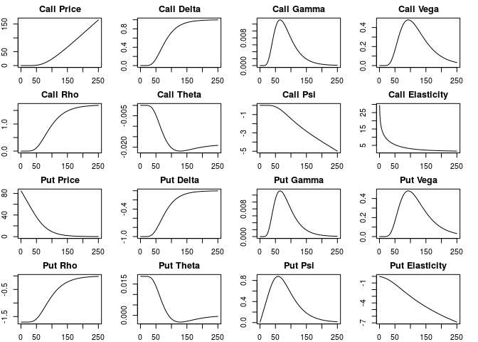

[](https://travis-ci.org/rmcd1024/derivmkts)[](http://www.r-pkg.org/pkg/derivmkts)

Introduction
------------

This is a collection of option pricing functions for a course in financial derivatives. The names of the functions mostly match those in my book *Derivatives Markets*, which explains the package name. This is the initial version; I expect to add and refine functions over time. Depending upon the level of the course, this package may or may not be helpful for students. I hope that at a minimum it will be helpful for instructors.

There are of course other option pricing packages in R, notably RQuantLib and fOptions. I don't claim to add significant pricing functionality to those. This package does, however, have a few aspects that might be unique, which I describe below.

The package includes functions for computing

-   Black-Scholes and barrier option prices

-   Greeks for European options

-   Option pricing and plotting using the binomial model

-   Pricing of options with jumps using the Merton model

-   Analytical and Monte Carlo pricing of Asian options

Things of note
--------------

### Calculation of Greeks

I have tried to make calculation of Greeks especially easy. The function `greeks()` allows vectorized calculation of greeks for any option pricing calculation based on the standard Black-Scholes or barrier option inputs.[1]

As an example, the following calculation will produce identical output, computing the full complement of greeks for a call, for three strike prices. You can access the delta values as, for example, `x['Delta', ]`.

``` r
x1 <- greeks(bscall(s=40, k=c(35, 40, 45), v=0.3, r=0.08, tt=0.25, d=0))
x1
```

                 bscall_35   bscall_40   bscall_45
    Price       6.13481997  2.78473666  0.97436823
    Delta       0.86401619  0.58251565  0.28200793
    Gamma       0.03636698  0.06506303  0.05629794
    Vega        0.04364029  0.07807559  0.06755753
    Rho         0.07106457  0.05128972  0.02576487
    Theta      -0.01340407 -0.01733098 -0.01336419
    Psi        -0.08640162 -0.05825156 -0.02820079
    Elasticity  5.63352271  8.36726367 11.57705764

The function

``` r
y <- bsopt(s=40, k=c(35, 40, 45), v=0.3, r=0.08, tt=0.25, d=0)
```

will do the same for both calls and puts simultanteously. The delta values for the call would be `y[['Call']]['Delta', ]`

My favorite example, which you should run, is this:

``` r
k <- 100; v <- 0.30; r <- 0.08; tt <- 2; d <- 0
S <- seq(.5, 250, by=.5)
x[[1]] <- greeks(bscall(S, k, v, r, tt, d))
x[[2]] <- greeks(bsput(S, k, v, r, tt, d))
txt <- c('Call', 'Put')
par(mfrow=c(4, 4))  ## create a 4x4 plot
for (i in 1:2) {
    for (j in rownames(x[[i]])) {  ## loop over greeks
        plot(S, x[[i]][j, ], main=paste(txt[i], j), ylab=j, type='l')
    }
}
```



This small bit of code computes and plots all call and put Greeks for 500 options. This is 16 plots in all. It's a great illustration of how powerful R can be.

### Binomial calculations

#### binomopt

By default the binomopt function returns the price of a American call. In adddition, with:

-   `putopt=TRUE` it returns the price of an American put.

-   `returngreeks=TRUE` it returns a subset of the Greeks along with the binomial parameters.

-   `returntrees=TRUE` it returns as a list all of the above plus the full binomial tree ($stree), the probability of reaching each node ($probtree), whether or not the option is exercised at each node ($exertree), and the replicating portfolio at each node ($deltatree and $bondtree).

Here is an example illustrating everything that the function can return:

    $price
       price 
    2.422205 

    $greeks
           delta        gamma        theta 
    -0.270179986  0.035153336 -0.005942682 

    $params
             s          k          v          r         tt          d 
    43.0000000 40.0000000  0.3000000  0.0800000  1.0000000  0.0000000 
         nstep          p         up         dn          h 
     3.0000000  0.4568067  1.2212461  0.8636926  0.3333333 

    $oppricetree
             [,1]      [,2]      [,3]      [,4]
    [1,] 2.422205 0.2312607 0.0000000  0.000000
    [2,] 0.000000 4.3852248 0.4372487  0.000000
    [3,] 0.000000 0.0000000 7.9235124  0.826714
    [4,] 0.000000 0.0000000 0.0000000 12.295777

    $stree
         [,1]     [,2]     [,3]     [,4]
    [1,]   43 52.51358 64.13201 78.32097
    [2,]    0 37.13878 45.35559 55.39034
    [3,]    0  0.00000 32.07649 39.17329
    [4,]    0  0.00000  0.00000 27.70422

    $probtree
         [,1]      [,2]      [,3]       [,4]
    [1,]    1 0.4568067 0.2086723 0.09532291
    [2,]    0 0.5431933 0.4962687 0.34004825
    [3,]    0 0.0000000 0.2950590 0.40435476
    [4,]    0 0.0000000 0.0000000 0.16027409

    $exertree
          [,1]  [,2]  [,3]  [,4]
    [1,] FALSE FALSE FALSE FALSE
    [2,] FALSE FALSE FALSE FALSE
    [3,] FALSE FALSE  TRUE  TRUE
    [4,] FALSE FALSE FALSE  TRUE

    $deltatree
             [,1]        [,2]        [,3]
    [1,] -0.27018 -0.02328712  0.00000000
    [2,]  0.00000 -0.56376275 -0.05097807
    [3,]  0.00000  0.00000000 -1.00000000

    $bondtree
             [,1]      [,2]      [,3]
    [1,] 14.03994  1.454151  0.000000
    [2,]  0.00000 25.322685  2.749389
    [3,]  0.00000  0.000000 38.947430

#### binomplot

This function plots the binomial tree, providing a visual depiction of the nodes, the probability of reaching each node, and whether exercise occurs at that node.

### Galton board or quincunx

The [Galton board](http://mathworld.wolfram.com/GaltonBoard.html) is a pegboard that illustrates the central limit theorem. Balls drop from the top and randomly fall right or left, providing a physical simulation of a binomial distribution. (My physicist brother-in-law tells me that real-life Galton boards don't typically generate a normal distribution because, among other things, balls acquire momentum in the direction of their original travel. The distribution is thus likely to be fatter-tailed than normal.)

You can see the Galton board in action with `quincunx()`.

Feedback
--------

Please feel free to contact me with bug reports or suggestions. Best would be to file an issue on Github, but email is fine as well.

I hope you find this helpful!

[1] In addition, `greeks2` performs the same calculations with a different calling convention, and `bsopt()` simultaneously computes prices and Greeks for European calls and puts.
